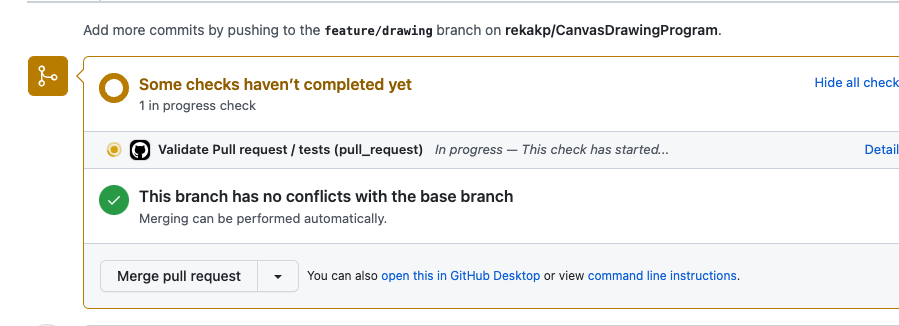
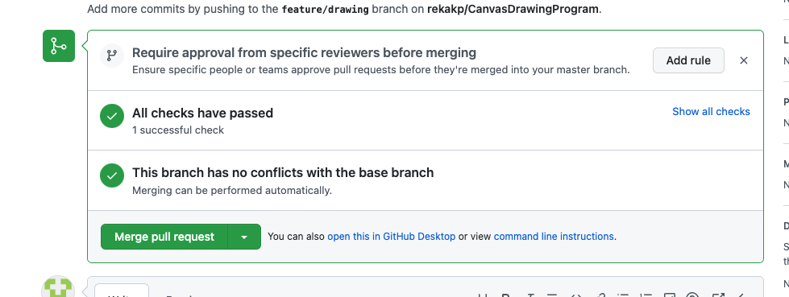
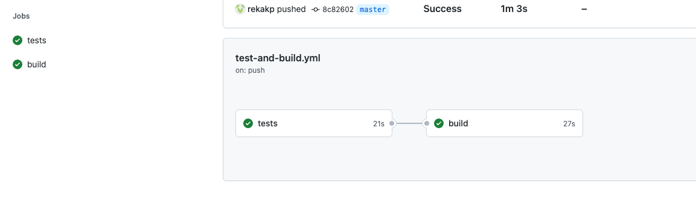

##Problem
Please implement a simple text (ASCII) based drawing program (something similar to a simplified version of Paint).   
The basic program should allow users to:  
Create a new canvas  
Draw on the canvas using text based commands  
Quit the program  
Your solution should run 'out of the box' and interactively (i.e. it should respond to commands entered manually, see below).  

---

## Tech/framework used  
- Java 11  
- Gradle  
- Junit  

---

## Build status

[build workflow](https://github.com/rekakp/CanvasDrawingProgram/actions/workflows/test-and-build.yml/badge.svg)

---

## Gradle Build and tests
To run the tests  

`./gradlew test`

To build 

`./gradlew build`

---

# Code explanation
## Main Entrypoint
The drawing.InputScanner is the main entry point for the code. The main() in InputScanner should be run to test the program.

### Design overview

####  Domain
- Canvas - domain corresponding to the Canvas command
- Line  - domain corresponding to the Line command
- Rectangle - domain corresponding to the Rectangle command

#### Factory

The ShapeFactory class is the factory class that returns the corresponding DrawService based on the command passed.  
If it,s a Line command , it returns the LineDrawService  
If its a Rectangle command , it returns the RectangleDrawService  
This enables to support the new commands easily.  

#### How to support new Shape Commands?  
To support a new Shape Command 
- Add a new Service that extends AbstractDrawService
  - Provide implementation for the key methods in AbstractDrawService
- Update the factory method
- The code will be able to handle the new command easily

---

### How to support Undo operation?  

Since paint program support undo operation, design has been done in a way to support UndoOperation in the future.  
The CommandProcessingService creates a DrawWindow which has a Canvas in it. 
When a new command is passed, the previous canvas will be stored in the DrawWindow - previousCanvas stack.  
If we need to a undo, the last used canvas can be popped from the previousCanvas stack.

---

## Pipelines

Basic pipelines have been added to test and build the project.  

### Validate PR workflow  
When a PR is raised, the valid PR workflow is triggered. Only if the steps of the workflow is successful, the PR is allowed to be merged.   
The tests are run as part of this step. Only if the tests are successful, the PR will be allowed to be merged.

### Build and test workflow
The build and test workflow runs everytime the code is merged to master.  
The tests are run and gradle build is also done as part of this workflow.
  








